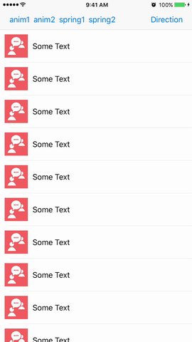
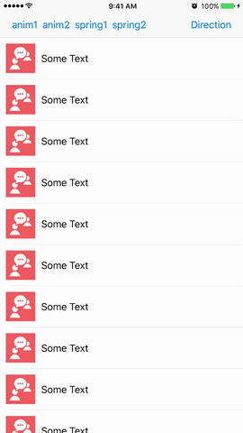
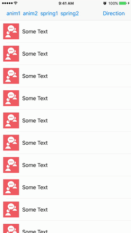
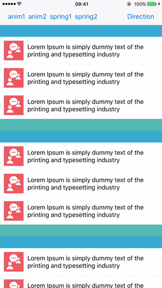
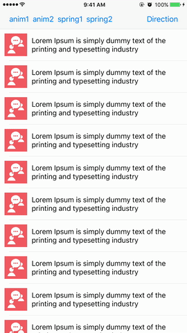
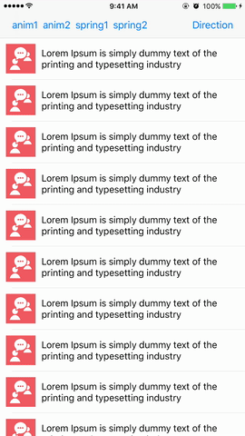
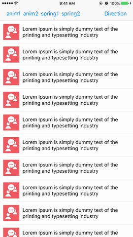

<h1 align="center">Reload tableview with animation</h1>

<table>
<tr>
<th>right to left</th>
<th>bottom to top</th>
<th>left to right</th>
<th>top to bottom</th>
</tr>
<tr>
<td></td>
<td></td>
<td></td>
<td></td>
</tr>
<tr>
<th>with header and footer</th>
<th>.rotation3D(type: .ironMan)</th>
<th>.rotation3D(type: .thor)</th>
<th>.rotation3D(type: .spiderMan)</th>
</tr>
<tr>
<td></td>
<td></td>
<td></td>
<td></td>
<tr>
<th>.rotation3D(type: .captainMarvel)</th>
<th>.rotation3D(type: .doctorStrange)</th>
<th>.rotation3D(type: .daredevil)</th>
<th>.rotation3D(type: .deadpool)</th>
</tr>
<tr>
<td></td>
<td></td>
<td></td>
<td></td>
</tr>
</table>

## Requirements

- iOS 9.0+

## Installation

### CocoaPods

[CocoaPods](http://cocoapods.org) is a dependency manager for Cocoa projects. You can install it with the following command:

```bash
$ gem install cocoapods
```

To integrate TableViewReloadAnimation into your Xcode project using CocoaPods, specify it in your `Podfile`:

```ruby
source 'https://github.com/CocoaPods/Specs.git'
platform :ios, '9.0'
use_frameworks!

target '<Your Target Name>' do
    pod 'TableViewReloadAnimation', '~> 0.0.5'
end
```

Then, run the following command:

```bash
$ pod install
```

## Usage

```swift
// left animation
tableView.reloadData(
    with: .simple(duration: 0.45, direction: .left(useCellsFrame: true),
    constantDelay: 0))

// right spring animation
tableView.reloadData(
    with: .spring(duration: 0.45, damping: 0.65, velocity: 1, direction: .right(useCellsFrame: false),
    constantDelay: 0))

// rotation spting animation
tableView.reloadData(
    with: .spring(duration: 0.45, damping: 0.65, velocity: 1, direction: .rotation(angle: Double.pi / 2),
    constantDelay: 0))

// rotation 3d
tableView.reloadData(
    with: .simple(duration: 0.75, direction: .rotation3D(type: .ironMan),
    constantDelay: 0))
```
